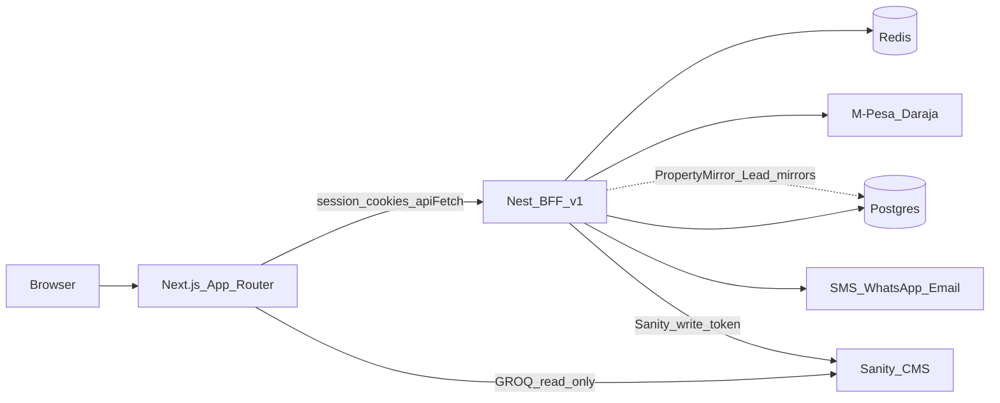

# RenderCon — BFF Talk Pitch & Demo

**Event:** RenderCon (CFP / speaker registration)  
**Topic:** Backend for Frontend (BFF)  
**Product demo:** GreenKey Realty (Nyeri-focused real estate)  
**Slides (PPTX):** [`RenderCon_Proxy_vs_BFF_Slides.pptx`](./RenderCon_Proxy_vs_BFF_Slides.pptx)  
**Full pitch (CFP copy/paste):** [`RENDERCON_FULL_PITCH.md`](./RENDERCON_FULL_PITCH.md)  
**Submission draft (proxy vs BFF):** [`RENDERCON_SUBMISSION_DRAFT.md`](./RENDERCON_SUBMISSION_DRAFT.md)  
**Full talk script:** [`RENDERCON_FULL_TALK_SCRIPT.md`](./RENDERCON_FULL_TALK_SCRIPT.md)  
**Slide content (markdown):** [`RENDERCON_SLIDE_CONTENT.md`](./RENDERCON_SLIDE_CONTENT.md)  
**Full talk runbook:** [`TECH_TALK_BFF.md`](./TECH_TALK_BFF.md)  
**Deploy context:** [`DEPLOY.md`](./DEPLOY.md)

---

## Talk title (pick one)

- **Backend for Frontend in Practice: NestJS + Next.js for a Real Estate Product**
- **Stop Putting Secrets in Next: A BFF Pattern for Auth, M-Pesa & CMS**
- **One Frontend, Many Backends: Building a Kenya-Ready BFF**

**Recommended:** *Backend for Frontend in Practice: NestJS + Next.js for a Real Estate Product*

---

## Format

| Field | Value |
|-------|--------|
| Length | 30–45 min (talk + live demo) |
| Level | Intermediate |
| Tracks | Web / fullstack / React |
| Stack | Next.js App Router · NestJS · Postgres/Prisma · Redis · Sanity · M-Pesa Daraja · Africa’s Talking / Infobip |

---

## One-liner

How we use a NestJS **Backend for Frontend** between Next.js and Postgres, Redis, Sanity, M-Pesa, and SMS/WhatsApp—so the browser never holds provider secrets, and web + mobile share one `/v1` API.

---

## Abstract (CFP ~150–200 words)

Modern React apps often talk to a CMS, a database, payment gateways, and messaging providers at once. Putting all of that in Next.js Server Actions or the browser quickly becomes a security and coupling problem.

This talk walks through a production-shaped **Backend for Frontend (BFF)** we built for GreenKey Realty (a Nyeri-focused real estate product): **Next.js App Router** for UI and httpOnly session cookies, and **NestJS `/v1`** as the BFF that owns OTP auth, JWT refresh, agent plans, Daraja M-Pesa, SMS/WhatsApp/email, and dual-writes to Sanity + Postgres.

You’ll see why a BFF is more than “just an API”: it defines ownership boundaries (CMS vs account state), hides Kenya-local provider credentials, and gives mobile a single contract. We’ll live-demo OTP sign-in, plan unlock, listing create (Sanity + mirror), and a lead—then close with tradeoffs (dual-write, where Next still reads Sanity).

---

## Audience takeaways

1. When a BFF pays off vs “everything in Next.”
2. How to split **content (Sanity)** vs **identity/billing (Postgres)** vs **ephemeral (Redis OTP).**
3. A concrete secret boundary: M-Pesa, AT/Infobip, JWT stay behind Nest; browser only hits same-origin `/api/*` or server actions.
4. Dual-write pattern for CMS UX + API/mobile search.

---

## Why this fits RenderCon

- Real React/Next product, not slides-only theory.
- Africa/Kenya stack (M-Pesa, Africa’s Talking, WhatsApp) as a clear BFF motivation.
- Patterns attendees can reuse on Vercel + a separate API host (Railway / Render / similar).

---

## Outline (for the form)

1. Hook — many backends, one UI  
2. Architecture — Browser → Next (cookies) → Nest BFF → providers  
3. Auth — OTP → Redis → JWT in httpOnly cookies → route gates  
4. Billing — plan gate + M-Pesa STK callback only on Nest  
5. CMS — Sanity reads on Next; writes via Nest + PropertyMirror  
6. Live demo (8–12 min)  
7. Tradeoffs & Q&A  

---

## Speaker bio (template — fill in)

> [Name] — fullstack engineer building GreenKey Realty. Working with Next.js, NestJS, Sanity, and Kenya payment/messaging providers. Passionate about practical architecture for product teams.

---

## Architecture (pitch slide)



---

## Demo — BFF use cases in this project

**Goal:** 8–12 minutes. Narrate each step as a **BFF job**, not only UI clicks.

| # | Use case | What you show | BFF point |
|---|----------|---------------|-----------|
| **A** | Secret boundary | DevTools Network: browser hits `/api/auth/*`, not Nest with tokens; Swagger `/docs` shows `/v1` | Next is session adapter; Nest holds JWT secrets |
| **B** | OTP + Redis | Sign in with phone/email; OTP in API logs (`SMS_PROVIDER=console`) or Mailtrap | Rate-limited OTP in Redis; providers never in the client |
| **C** | Cookie session | After verify, response is `{user}` only; cookies `gk_access` / `gk_refresh` httpOnly | Browser never stores raw JWTs |
| **D** | Aggregation | `/saved` or property → Save — Postgres IDs + Sanity cards | BFF joins account state + CMS content |
| **E** | Billing secrets | `/pricing` → STK or **simulate-complete**; callback URL is Nest-only | Daraja keys + Safaricom callback stay on BFF |
| **F** | Dual-write | Create listing → Sanity Studio doc + Postgres `PropertyMirror` | CMS UX + mirror for API/mobile |
| **G** | Lead loop | Incognito “Contact agent” → agent `/dashboard/leads` | Write path through Nest; UI can still read Sanity |

### Tight demo script

1. Browse `/` → `/properties`
2. OTP sign-in → onboarding if needed → save listing
3. Pricing → unlock agent plan (simulate STK)
4. Create listing (category fields) → open `/studio`
5. Second browser: contact agent → leads status
6. Close: “Why not M-Pesa in Next?” → secrets + callbacks + shared mobile API

### Demo prep

```bash
pnpm install
pnpm docker:up
pnpm --filter @greenkey/api prisma migrate deploy   # if needed
pnpm seed                                           # optional Nyeri seed
```

```powershell
pnpm dev:api    # http://localhost:4000/v1  — docs at /docs
pnpm dev        # http://localhost:3000
```

**Demo-safe providers**

- OTP: `SMS_PROVIDER=console` / `EMAIL_PROVIDER=console` (codes in API logs)
- M-Pesa: omit live keys → use **simulate-complete** on the same code path
- Full env checklist: [`TECH_TALK_BFF.md`](./TECH_TALK_BFF.md#demo-runbook)

| Surface | URL |
|---------|-----|
| Web | http://localhost:3000 |
| Studio | http://localhost:3000/studio |
| API docs | http://localhost:4000/docs |
| Health | http://localhost:4000/v1/health |

---

## Success criteria (after the talk)

- Audience can explain **what Nest owns vs Sanity**.
- Live path works: OTP → plan → listing → lead.
- Clear answer to “why not put M-Pesa in Next?” (secret boundary + callback + mobile contract).
