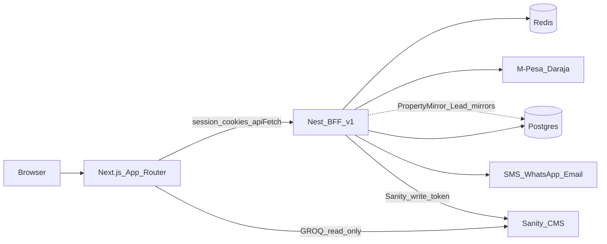

# GreenKey Realty — Backend for Frontend Tech Talk

**Length:** 30–45 minutes (engineers / meetup)  
**Demo product:** GreenKey Realty (Nyeri-focused real estate)  
**Stack:** Next.js App Router + NestJS BFF (`/v1`) + Postgres + Redis + Sanity + M-Pesa / SMS / email  
**Slides (PPTX):** [`RenderCon_Proxy_vs_BFF_Slides.pptx`](./RenderCon_Proxy_vs_BFF_Slides.pptx)  
**Full pitch (CFP copy/paste):** [`RENDERCON_FULL_PITCH.md`](./RENDERCON_FULL_PITCH.md)  
**CFP / RenderCon pitch:** [`RENDERCON_BFF_PITCH.md`](./RENDERCON_BFF_PITCH.md)  
**Submission draft (proxy vs BFF):** [`RENDERCON_SUBMISSION_DRAFT.md`](./RENDERCON_SUBMISSION_DRAFT.md)  
**Full talk script:** [`RENDERCON_FULL_TALK_SCRIPT.md`](./RENDERCON_FULL_TALK_SCRIPT.md)  
**Slide content (markdown):** [`RENDERCON_SLIDE_CONTENT.md`](./RENDERCON_SLIDE_CONTENT.md)

---

## Talk goal

Show why a **Backend for Frontend** sits between the Next.js client and multiple backends (Postgres, Redis, Sanity, M-Pesa, SMS/WhatsApp/email)—and prove it with a live flow: **OTP → pay → create category listing → receive lead**.

---

## Architecture diagram



---

## Core teaching points

1. **BFF is not “just an API”** — Nest owns identity, plans, payments, OTP delivery, rate limits, and mirrors for ops/mobile.
2. **CMS ≠ system of record for everything** — Sanity owns listing *content*; Postgres owns *account state*.
3. **Next is a composition layer** — `proxy.ts` gates routes; `lib/api` + `app/api` talk to Nest; `actions/*` + `lib/sanity` talk to Sanity.
4. **Dual-write is intentional** — Agent UI is Sanity-first for listings/leads; Nest mirrors support search, ownership, and future mobile clients.
5. **Kenya-local stack as BFF value** — M-Pesa, Africa’s Talking / Infobip, Mailtrap/SMTP stay behind Nest so the browser never holds provider secrets.

### Data ownership

| Concern | Owner |
|---------|--------|
| Property media, description, category fields | Sanity |
| User, JWT refresh, roles | Postgres |
| OTP codes, rate limits, M-Pesa locks | Redis |
| Subscriptions, payments | Postgres + Nest billing |
| Agent dashboard listing UI | Sanity (writes via Nest BFF) |
| PropertyMirror / Lead ops rows | Postgres (via Nest) |

---

## Timed outline

| Section | Time | Notes |
|---------|------|--------|
| 0. Hook | 2 min | CMS + auth + billing + SMS + M-Pesa can’t all live in Next or Sanity alone |
| 1. Product tour | 3 min | Home → properties map → pricing |
| 2. BFF in this repo | 8 min | Monorepo, `/v1`, Swagger `/docs`, module map |
| 3. Auth deep-dive | 5 min | OTP → Redis → JWT cookies → `proxy.ts` gates |
| 4. Billing deep-dive | 4 min | Plan gate → STK / bank → `Subscription.ACTIVE` |
| 5. Category listings | 5 min | `listingCategory` × `propertyType` field packs |
| 6. Live demo | 10–12 min | Script below |
| 7. Tradeoffs | 3 min | Dual-write, boundaries, mobile next |
| 8. Q&A | 5 min | |

---

## Slide / talking-point checklist

- [ ] Problem → BFF solution diagram
- [ ] Monorepo layout (`app/`, `apps/api/`, `sanity/`)
- [ ] Auth sequence (OTP → Redis → JWT → cookies → proxy)
- [ ] Ownership matrix (Sanity / Postgres / Redis)
- [ ] Provider abstraction (email / SMS / WhatsApp / M-Pesa)
- [ ] Category field packs as domain modeling
- [ ] Dual-write + mirror sync honesty
- [ ] Demo runbook (env, simulate STK)
- [ ] Lessons learned

---

## Live demo script

1. **Browse** — `/` → `/properties?category=rent` → map tab.
2. **Buyer** — open property → Sign in (OTP) → onboarding if needed → Save listing.
3. **Become agent** — `/pricing` → M-Pesa simulate or bank → dashboard unlock.
4. **Agent onboarding** — `/dashboard/onboarding`.
5. **Create listing** — flip rent → Airbnb → villa → farmland fields → Mapbox pin → publish.
6. **Optional Studio** — `/studio` same document.
7. **Lead loop** — incognito buyer → Contact Agent → `/dashboard/leads` status change.
8. **Billing** — `/dashboard/invoices` or `/dashboard/billing`.
9. **Architecture proof** — Swagger `http://localhost:4000/docs` (optional Redis OTP key).

---

## Demo runbook

### Prerequisites

```bash
pnpm install
pnpm docker:up          # Postgres :5433, Redis :6379
pnpm --filter @greenkey/api prisma migrate deploy   # if needed
```

**API + Next:**

```powershell
pnpm dev:api            # http://localhost:4000/v1  — docs at /docs
# other terminal:
npm run dev             # http://localhost:3000
```

Scripts set `--use-system-ca` automatically (Windows AV TLS). No need to export `NODE_OPTIONS` by hand.

**Cloud (staging / production):** see [`docs/DEPLOY.md`](./DEPLOY.md) — Vercel + Railway + Upstash + Sanity datasets.

JWT access cookies last 15 minutes. `proxy.ts` silently rotates them via Nest `POST /auth/refresh` when you navigate protected routes. You can also hit `POST /api/auth/refresh` if a long SPA session needs a manual refresh.

### Env checklist

| Where | Vars |
|-------|------|
| Root `.env.local` | `NEXT_PUBLIC_SANITY_PROJECT_ID`, `NEXT_PUBLIC_SANITY_DATASET`, `SANITY_API_TOKEN`, `SANITY_API_READ_TOKEN`, `NEXT_PUBLIC_MAPBOX_TOKEN`, `NEXT_PUBLIC_API_URL=http://localhost:4000/v1` |
| `apps/api/.env` | `DATABASE_URL`, `REDIS_URL`, `JWT_*`, `SANITY_PROJECT_ID`, `SANITY_WRITE_TOKEN`, `EMAIL_PROVIDER`, `SMS_PROVIDER`, `WHATSAPP_*`, optional `MPESA_*` |

### Demo-safe providers

- **OTP:** `SMS_PROVIDER=console` / `EMAIL_PROVIDER=console` prints codes in API logs; or real Infobip / Africa’s Talking / Mailtrap.
- **M-Pesa:** omit `MPESA_*` → STK creates pending payment → use **simulate-complete** from checkout UI / API so the room understands it’s the same code path without Daraja sandbox.
- **Sanity live warnings:** set `SANITY_API_READ_TOKEN` (Viewer token from [sanity.io/manage](https://www.sanity.io/manage) → API → Tokens).

### Seed (Nyeri-aligned)

```bash
pnpm seed:clean
pnpm seed
```

### URLs

| Surface | URL |
|---------|-----|
| Web | http://localhost:3000 |
| Studio | http://localhost:3000/studio |
| API docs | http://localhost:4000/docs |
| Health | http://localhost:4000/v1/health |

---

## Tradeoffs & “what next” (closing)

- Dual-write (Sanity + PropertyMirror / Lead) needs explicit sync on create/update/delete.
- Secrets and provider swaps belong in the BFF, not Next server actions alone.
- Next step: mobile client consuming Nest only; optional move of Sanity writes behind Nest `SanityService`.

---

## Success criteria

- Audience can explain **what Nest owns vs Sanity**.
- Live path works end-to-end (OTP → plan → listing → lead).
- Category listing fields change in the form and appear on the public detail page.
- You can answer “why not put M-Pesa in Next?” with the BFF secret-boundary argument.
